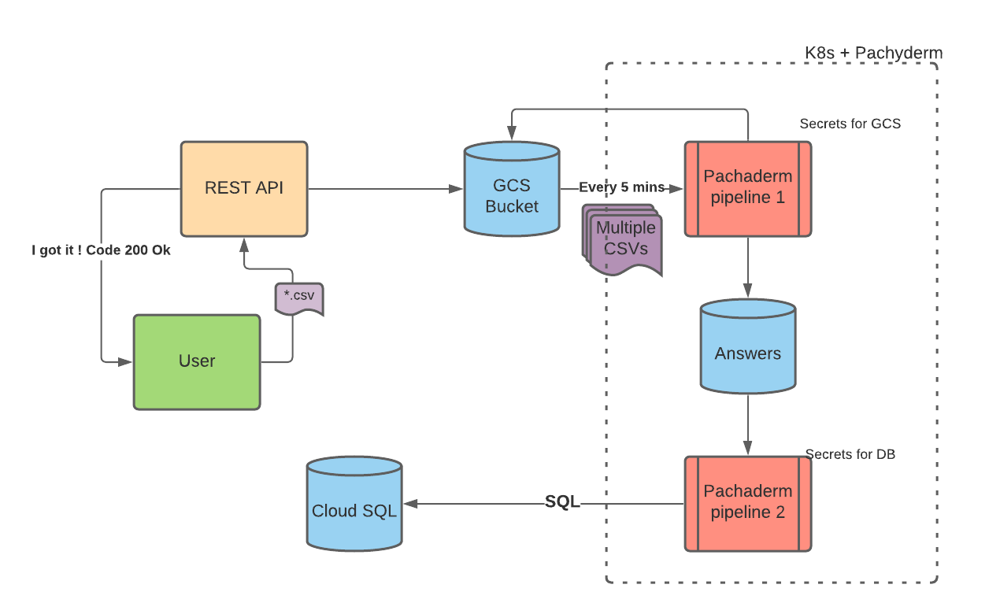
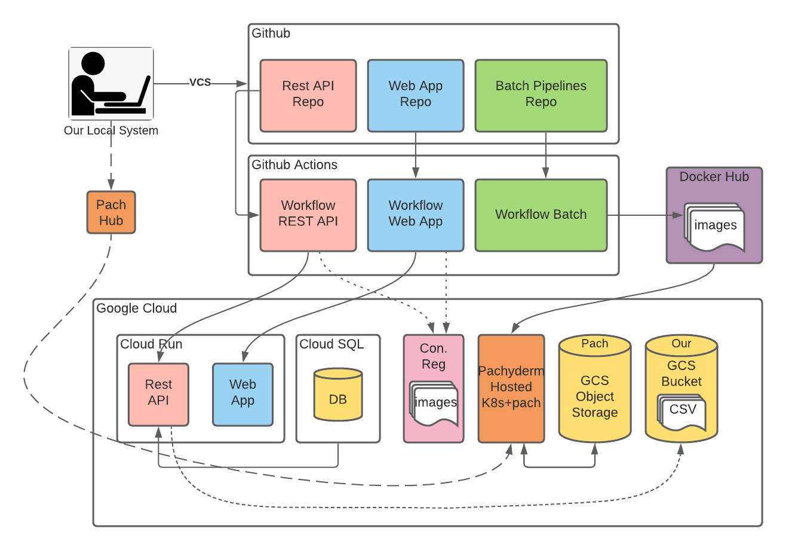
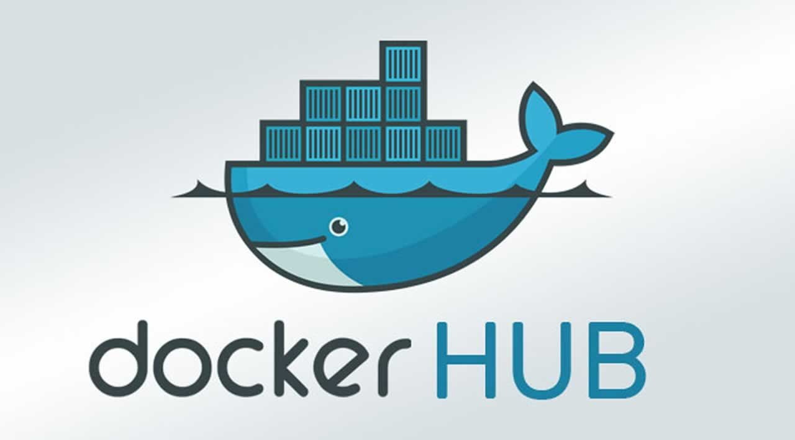
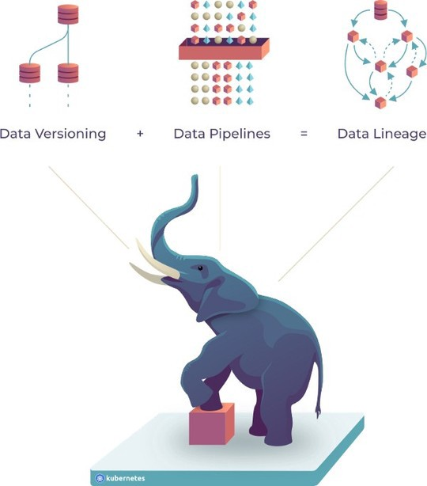
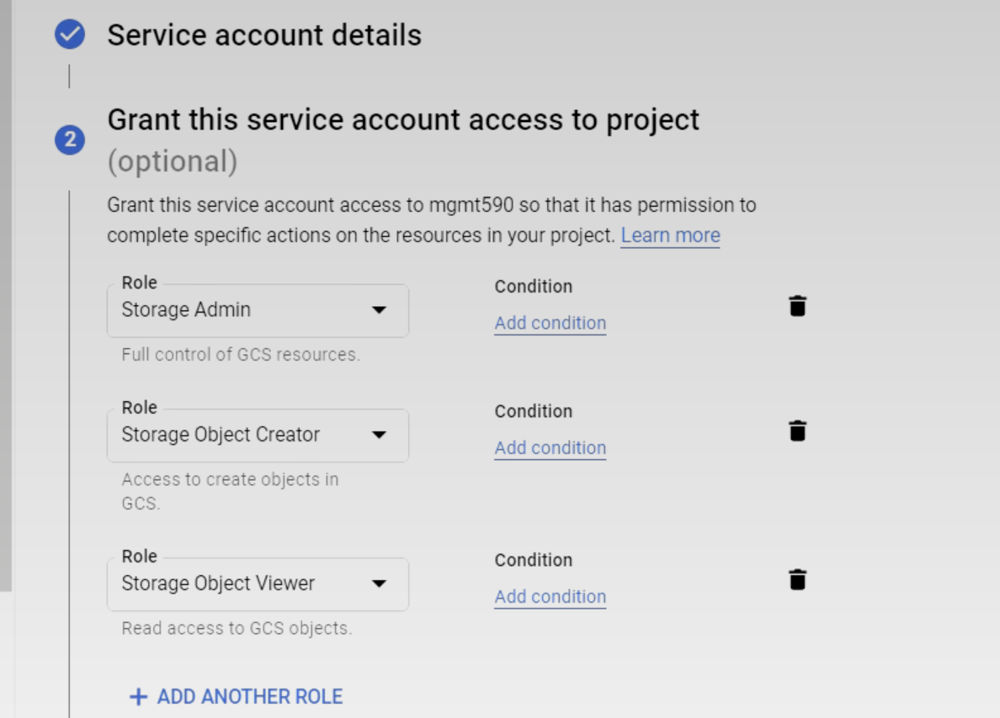
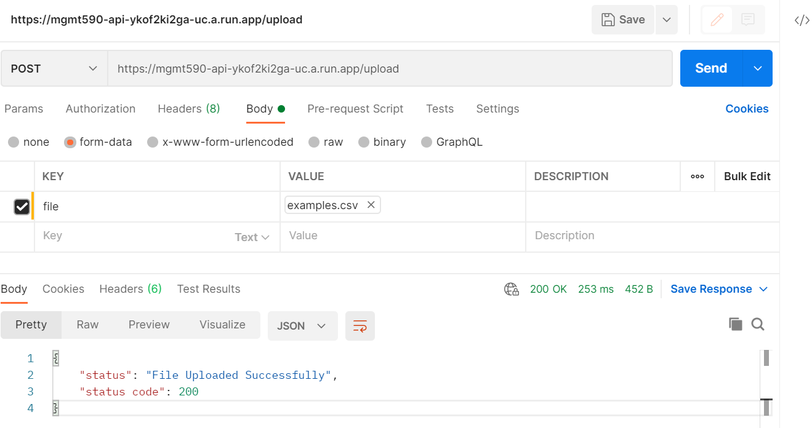
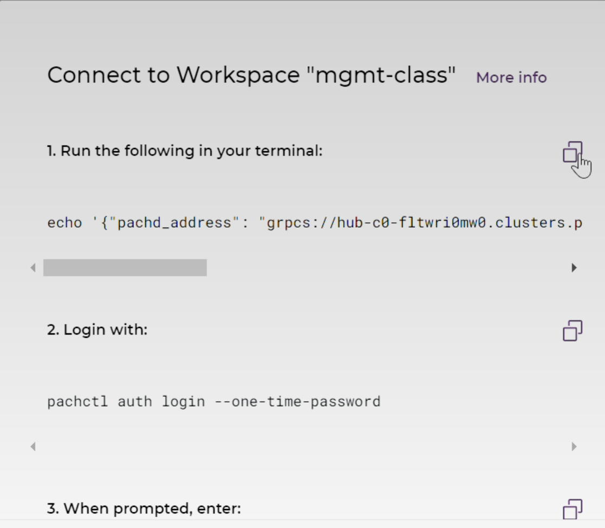

# MGMT 590 (Prod Scale Data Products) - Assignment #4 Batch Pipeline

This repo contains the master solution for Assignment #4 in the Summer 2021 edition of MGMT 590 (Production Scale Data Products) at Purdue University. Specifically, this repo includes code and config for running a Bacth Pipeline using Dockerhub and Pachyderm for question answering using pre-trained models from [Hugging Face Transformers](https://huggingface.co/models).

## Overview / Architecture



We are using our Laptop/Cloud Shell to push our code Github which is version controlled and contains the repositories corresponding to our REST API,Web App(These were a part of of our assignment 3), additionally which we have included a Batch processing Pipeline Repo. The REST API and Web App are triggred via github actions workflow and build and deployed to Google cloud Run. 

We also have a Cloud SQL instance of POSTGRES for our CRUD operations on flask and streamlit. There's also a container Registry which contains the images of our buid deploys.The github actions workflow for Batch Pipelines builds and deploys to DockerHub instead of Google cloud. We're using Pachyderm Hub to host Pachyderm and Kubernetes Cluster.

In our assignment we are going to have a GCS(Google Cloud Storage), which is going to have .csv files stored and these csv will be put in by our REST API by a new route /uploads  allowing a user to upload a CSV file with a column of questions and a column of contexts. This CSV file should be pushed by the REST API into a GCS bucket (where your Pachyderm pipeline will read it in for processing). The new route should return a 200 OK code and a message to the user indicating that it successfully pushed the file to the GCS bucket.



# Docker Hub



Docker Hub ``is a cloud-based registry service`` which provides a centralized resource for container image discovery, distribution and change management, user and team collaboration, and workflow automation throughout the development pipeline. There are both private and public repositories. Private repository can only be used by people 
within their own organization.

Docker Hub is ``hardcoded into Docker as the default registry``, which means that the docker pull command will initialize the download automatically from Docker Hub.

# Pachyderm: Data Versioning, Data Pipelines, and Data Lineage



Pachyderm is a tool for version-controlled, automated, end-to-end data pipelines for data science. If you need to chain together data scraping, ingestion, cleaning, munging, wrangling, processing,
modeling, and analysis in a sane way, while ensuring the traceability and provenance of your data, Pachyderm is for you. If you have an existing set of scripts which do this in an ad-hoc fashion and you're looking
for a way to "productionize" them, Pachyderm can make this easy for you.

## Features

- Containerized: Pachyderm is built on Docker and Kubernetes. Whatever
  languages or libraries your pipeline needs, they can run on Pachyderm which
  can easily be deployed on any cloud provider or on prem.
- Version Control: Pachyderm version controls your data as it's processed. You
  can always ask the system how data has changed, see a diff, and, if something
  doesn't look right, revert.
- Provenance (aka data lineage): Pachyderm tracks where data comes from. Pachyderm keeps track of all the code and  data that created a result.
- Parallelization: Pachyderm can efficiently schedule massively parallel
  workloads.
- Incremental Processing: Pachyderm understands how your data has changed and
  is smart enough to only process the new data
  
## Requirements

```
transformers==4.6.1
flask==2.0.1
pysqlite3
psycopg2-binary
pytest==6.2.2
pandas
google-cloud-storage
```

## Environment variables and scripts that need to be in place 


```shell 
    
DOCKERHUB_TOKEN
    
DOCKERHUB_USERNAME
    
GCS_CREDS
```

Here, the DOCKERHUB_TOKEN is the Docker Hub password and DOCKERHUB_USERNAME is the user id of the DockerHub. This is needed as there's an authentication process involved in our workflow. The third secret GCS_CREDS is used to set the environment variable GOOGLE_APPLICATION_CREDENTIALS.

Apart from these there are certain pipeline specs that we need to create that are pipeline1_spec.json and pipeline2_spec.json which are used to create the pipelines respectively. There are scripts which aid us in setting the environment variables during the pachyderm run of our images from DockerHub. Below is the folder structure , for our project folder:

```shell 
    
YAML File
build_and_push.yml

Pipeline 1
Dockerfile
pipeline1_spec.json
question_answer_pd.py
requirements.txt

Pipeline 2
Dockerfile
answer_insert.py
pipeline2_spec.json
requirements.txt

Home
create_secret.sh
secret_template.json
secret_template_db.json

```


# Steps Followed

## 1. Create a GCS Bucket for Artifact Storage

We can create a GCS Bucket either using the UI and going to Cloud Storage or through console as following:

a. Log in with `gcloud`:

  ```
  $ gcloud auth login
  ```

b. Run the `gsutil mb` command to create a bucket within your GCP project, giving your project’s ID (`PROJECT_ID` below) and the name of the bucket to create (`BUCKET`):

  ```
  $ PROJECT_ID=<Insert Project ID>
  $ BUCKET=gs://<Insert Bucket Name>
  $ gsutil mb -p $PROJECT_ID $BUCKET
  ```

# 2.Cloud Storage client library

Once our bucket is setup we can use the Google cloud storage client to interatct with it.

This tutorial shows how to get started with the [Cloud Storage Python client library](https://googleapis.github.io/google-cloud-python/latest/storage/index.html).

## Create a storage bucket

Buckets are the basic containers that hold your data. Everything that you store in Cloud Storage must be contained in a bucket. You can use buckets to organize your data and control access to your data.

Start by importing the library:


```python
from google.cloud import storage
```

The `storage.Client` object uses your default project. Alternatively, you can specify a project in the `Client` constructor. For more information about how the default project is determined, see the [google-auth documentation](https://google-auth.readthedocs.io/en/latest/reference/google.auth.html).

Run the following to create a client with your default project:

## Upload a local file to a bucket

Objects are the individual pieces of data that you store in Cloud Storage. Objects are referred to as "blobs" in the Python client library. There is no limit on the number of objects that you can create in a bucket.

An object's name is treated as a piece of object metadata in Cloud Storage. Object names can contain any combination of Unicode characters (UTF-8 encoded) and must be less than 1024 bytes in length.

For more information, including how to rename an object, see the [Object name requirements](https://cloud.google.com/storage/docs/naming#objectnames).


```python
blob_name = "us-states.txt"
blob = bucket.blob(blob_name)

source_file_name = "resources/us-states.txt"
blob.upload_from_filename(source_file_name)

print("File uploaded to {}.".format(bucket.name))
```

## List blobs in a bucket


```python
blobs = bucket.list_blobs()

print("Blobs in {}:".format(bucket.name))
for item in blobs:
    print("\t" + item.name)
```

## Get a blob and display metadata

See [documentation](https://cloud.google.com/storage/docs/viewing-editing-metadata) for more information about object metadata.


```python
blob = bucket.get_blob(blob_name)

print("Name: {}".format(blob.id))
print("Size: {} bytes".format(blob.size))
print("Content type: {}".format(blob.content_type))
print("Public URL: {}".format(blob.public_url))
```

## Download a blob to a local directory


```python
output_file_name = "resources/downloaded-us-states.txt"
blob.download_to_filename(output_file_name)

print("Downloaded blob {} to {}.".format(blob.name, output_file_name))
```

## Cleaning up

### Delete a blob


```python
blob = client.get_bucket(bucket_name).get_blob(blob_name)
blob.delete()

print("Blob {} deleted.".format(blob.name))
```

## 3.Set Environment Variable

```python
export GOOGLE_APPLICATION_CREDENTIALS="KEY_PATH"
Replace KEY_PATH with the path of the JSON file that contains your service account key.

For example:


export GOOGLE_APPLICATION_CREDENTIALS="/home/user/Downloads/service-account-file.json"
```

## 4.Create Service Accounts/Roles

We then proceed to create a service account the below three user roles as displayed in the image.




## 5.Run the file upload REST API Route

We then run the file upload REST API route which leads to the uploading of the csv file to the google cloud bucket that we made earlier.A sample request and response is shown below:



## 5.Connect to Pachctl

Our next step is to connect to pachctl. The below image tells the step to connect to pachctl.



## 6.Create and Manage Secrets in Pachyderm

The next step is to create secrets in pachyderm. Pachyderm uses Kubernetes' Secrets to store and manage sensitive data, such as passwords, OAuth tokens, or ssh keys. You can use any of Kubernetes' types of Secrets that match your use case. Namely, generic (or Opaque), tls, or docker-registry.

As of today, Pachyderm only supports the JSON format for Kubernetes' Secrets files.
To use a Secret in Pachyderm, you need to:

Create it.

Reference it in your pipeline's specification file.

##Create a Secret

The creation of a Secret in Pachyderm requires a JSON configuration file.

A good way to create this file is:

1. To generate it by calling a dry-run of the kubectl create secret ... --dry-run=client --output=json > myfirstsecret.json command.
2. Then call pachctl create secret -f myfirstsecret.json.

##Reference a Secret in Pachyderm's specification file¶

Now that your secret is created on Pachyderm cluster, you will need to notify your pipeline by updating your pipeline specification file. In Pachyderm, a Secret can be used in many different ways. Below, I'm describing the way we used :

As a container environment variable:

In this case, in Pachyderm's pipeline specification file, you need to reference Kubernetes' Secret by its name
and specify an environment variable named env_var that the value of your key should be bound to.
This makes for easy access to your Secret's data in your pipeline's code. For example, this is useful for passing the password to a third-party system to your pipeline's code.

```json
   "description":"A pipeline that pushes answers to the database",
   "transform":{
      "cmd":[
         "python",
         "/app/answer_insert.py"
      ],
      "image":"xyz",
      "secrets":[
         {
            "name":"dbaccess",
            "env_var":"PG_HOST",
            "key":"host"
         },
```
##6.Running the commands in pachctl

After connecting the to the pachctl and creating the repo we can list it using ``pchctl list repo``

```shell
sai2811@docker-ubuntu-1-vm:~$ pachctl list repo
NAME                 CREATED     SIZE (MASTER) ACCESS LEVEL
push-answers-to-sql  3 hours ago 3.235KiB      OWNER        Output repo for pipeline push-answers-to-sql.
question_answer      3 hours ago 3.235KiB      OWNER        Output repo for pipeline question_answer.
question_answer_tick 3 hours ago 0B            OWNER        Cron tick repo for pipeline question_answer.
```

After that we can create the pipeline using the  ``pachctl create pipeline -f pipeline1_spec.json`` command

We can view the pipeline created using the following command: ``pachctl list pipeline -f pipeline1_spec.json``
```shell
pachctl list pipeline
sai2811@docker-ubuntu-1-vm:~$ pachctl list pipeline
NAME                VERSION INPUT             CREATED        STATE / LAST JOB   DESCRIPTION
push-answers-to-postgre 1       question_answer:/ 6 seconds ago  running / starting A pipeline that pushes answers to the database
question_answer     1       tick:@every 300s  11 seconds ago running / starting A pipeline that dowloads files from GCS and answers questions.
```

We can then view the logs using the following command: ``pachctl logs -v -j``


```shell    
sai2811@docker-ubuntu-1-vm:~$ pachctl logs -v -j 5d2c5ec96cf34c8fa02f47b84516e23e
[0000]  INFO parsed scheme: "dns" source=etcd/grpc
[0000]  INFO ccResolverWrapper: sending update to cc: {​​​​​​​[{​​​​​​​35.185.199.42:31400  <nil> 0 <nil>}​​​​​​​] <nil> <nil>}​​​​​​​ source=etcd/grpc
[0000]  INFO ClientConn switching balancer to "pick_first" source=etcd/grpc
2021-06-13 02:20:06.993141: I tensorflow/core/platform/cpu_feature_guard.cc:142] This TensorFlow binary is optimized with oneAPI Deep Neural Network Library (oneDNN) to use the following CPU instructions in performance-critical operations:  AVX2 FMA
To enable them in other operations, rebuild TensorFlow with the appropriate compiler flags.
2021-06-13 02:20:07.029095: W tensorflow/python/util/util.cc:348] Sets are not currently considered sequences, but this may change in the future, so consider avoiding using them.
2021-06-13 02:20:07.100361: W tensorflow/core/framework/cpu_allocator_impl.cc:80] Allocation of 93763584 exceeds 10% of free system memory.
2021-06-13 02:20:07.349987: W tensorflow/core/framework/cpu_allocator_impl.cc:80] Allocation of 93763584 exceeds 10% of free system memory.
2021-06-13 02:20:07.382704: W tensorflow/core/framework/cpu_allocator_impl.cc:80] Allocation of 93763584 exceeds 10% of free system memory.
2021-06-13 02:20:08.516193: W tensorflow/core/framework/cpu_allocator_impl.cc:80] Allocation of 93763584 exceeds 10% of free system memory.
2021-06-13 02:20:08.618882: W tensorflow/core/framework/cpu_allocator_impl.cc:80] Allocation of 93763584 exceeds 10% of free system memory.
All model checkpoint layers were used when initializing TFDistilBertForQuestionAnswering.


All the layers of TFDistilBertForQuestionAnswering were initialized from the model checkpoint at distilbert-base-uncased-distilled-squad.
If your task is similar to the task the model of the checkpoint was trained on, you can already use TFDistilBertForQuestionAnswering for predictions without further training.
Downloading Files
Inside the File List Loop
Blob Created
File Downloaded as string
Calling the Question Answer Function
file_read
file_aded to intmd
writing file to location
question_answer completed
calling delete function
delete completed
```
